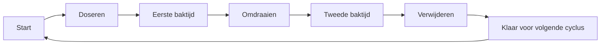

# De automatische pannenkoekmachine

Een multidisciplinair project van studenten Elektronica-ICT aan VIVES.

## Over het project

Binnen dit project ontwerpen en bouwen we een automatische pannenkoekmachine die een volledige bakcyclus zelfstandig kan uitvoeren:

1. Een vooraf ingestelde hoeveelheid deeg doseren.
2. Het deeg op een verwarmde bakplaat aanbrengen.
3. De eerste zijde gedurende een ingestelde tijd bakken.
4. De pannenkoek automatisch omdraaien.
5. De tweede zijde bakken.
6. De afgewerkte pannenkoek van de bakplaat verwijderen en naar een opvangplaats brengen.

Het doel is een betrouwbare en demonstratieklare proof-of-concept waarin mechanica, elektronica, PCB-design, sensoren en embedded software samenkomen.

## Doelstellingen

- Een reproduceerbare en instelbare deegdosering realiseren.
- Een betrouwbaar mechanisme ontwerpen om de pannenkoek om te draaien.
- De afgewerkte pannenkoek automatisch verwijderen.
- Een duidelijke toestandsmachine voor de volledige bakcyclus implementeren.
- Motoren, actuatoren en sensoren veilig aansturen.
- Een eigen PCB ontwerpen voor de centrale besturing en interfaces.
- Een eenvoudige gebruikersbediening voorzien voor onder andere deegvolume en baktijden.
- Foutdetectie, noodstoppen en eindschakelaars integreren.
- De machine testen op nauwkeurigheid, veiligheid en herhaalbaarheid.

## Proces



De besturing wordt opgebouwd als een toestandsmachine. Elke procesfase voert alleen de acties uit die op dat moment nodig zijn en controleert waar mogelijk de toestand van de machine met behulp van sensoren en eindschakelaars.

## Systeemonderdelen

### Mechanica

- Doseersysteem voor het pannenkoekendeeg
- Verwarmde bakplaat
- Mechanisme voor het omdraaien van de pannenkoek
- Mechanisme voor het verwijderen en verplaatsen van de pannenkoek
- Constructie die geschikt is voor gebruik rond warmte en voedsel

### Elektronica

- Centrale microcontroller
- Voedingen voor besturing, motoren en actuatoren
- Motor- en actuatorsturing
- Sensoren voor positie, eindpunten en procesbewaking
- Interface voor de bakplaat en eventuele temperatuurmeting
- Eigen PCB met connectoren en beveiligingen

### Software

- Toestandsmachine voor de bakcyclus
- Instelbaar deegvolume
- Instelbare eerste en tweede baktijd
- Start-, stop- en resetprocedure
- Sensor- en eindschakelaarverwerking
- Foutdetectie en veilige fouttoestand
- Weergave van de huidige procesfase en resterende tijd

## Team

| Naam | Opleiding | Focus binnen het project |
| --- | --- | --- |
| Brent Viveyn | Game & Entertainment Technology | Software, automatisering en systeemintegratie |
| Hengda Lin | Network & System Administration | Elektronica, infrastructuur en systeemintegratie |
| Lars Ysebaert | Game & Entertainment Technology | Embedded software en automatisering |
| Mauro Carlier | Game & Entertainment Technology | Prototyping, mechanica en testing |

De exacte taakverdeling kan tijdens het project wijzigen. We werken samen over de grenzen van mechanica, elektronica en software heen.

## Veiligheid

Veiligheid is een belangrijk onderdeel van het ontwerp. Daarom houden we rekening met:

- Een duidelijke noodstop
- Eindschakelaars en gecontroleerde bewegingslimieten
- Een veilige toestand bij fouten of onverwachte reacties
- Bescherming tegen hete onderdelen
- Veilige bediening tijdens demonstraties
- Scheiding en beveiliging van verschillende spannings- en vermogensniveaus

## Testen en validatie

Tijdens het project testen we onder andere:

- De nauwkeurigheid en reproduceerbaarheid van de deegdosering
- De betrouwbaarheid van het draaimechanisme
- De werking van het verwijdermechanisme
- De invloed van deegvolume en baktijd op het resultaat
- De betrouwbaarheid van motoren, actuatoren en sensoren
- De veiligheid en gebruiksvriendelijkheid van de volledige machine

Testresultaten worden gebruikt om het mechanische ontwerp, de elektronica en de software iteratief te verbeteren.

## Projectstatus

Het project bevindt zich in de ontwerp- en prototypingfase. De concrete componentkeuze, mechanische constructie, PCB en firmware worden tijdens het project verder uitgewerkt en gevalideerd.

## Repositorystructuur

De repository wordt aangevuld naarmate het project vordert. Verwachte onderdelen zijn onder andere:

```text
AutomatischePannenkoekmachine/
├── README.md
├── docs/          # Ontwerpdocumentatie en testresultaten
├── firmware/      # Embedded software
├── hardware/      # Schema's en PCB-bestanden
└── mechanical/    # CAD-bestanden en mechanische ontwerpen
```

## Opleiding

**VIVES Hogeschool - Elektronica-ICT**

Product owner: **Pedro Calleeuw**
